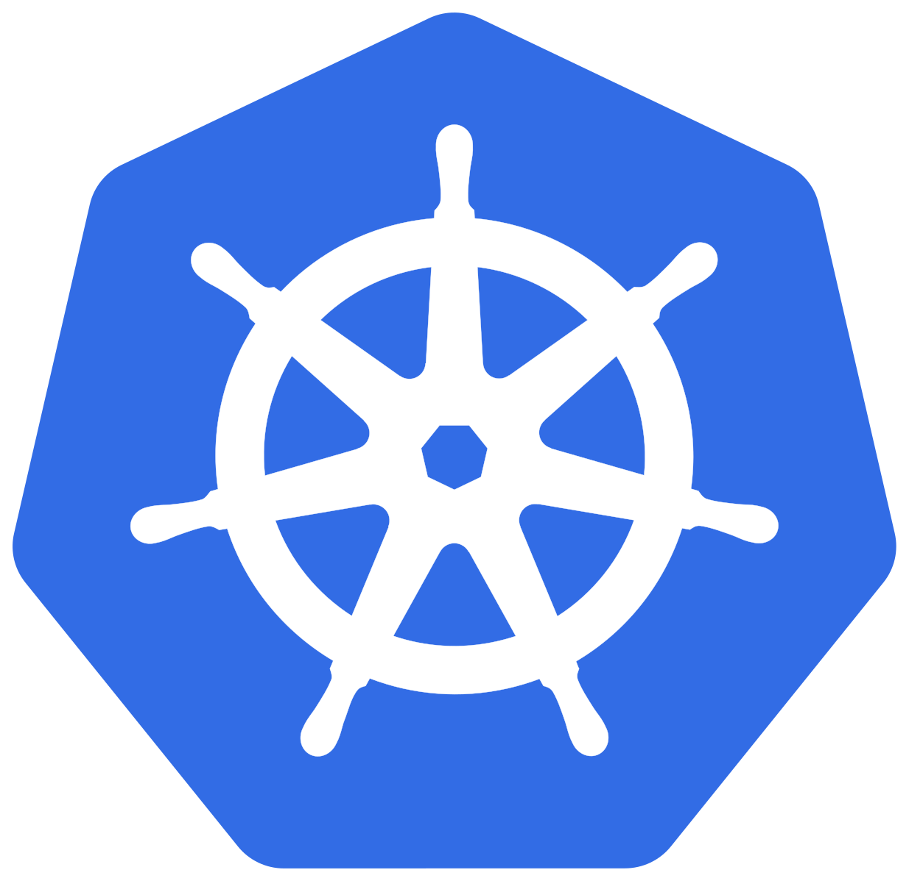

<h1 align="center">
  
  
  <br />
</h1>
<p align="center">Set up your <strong>MLOps platform</strong> on your Kubernetes cluster</p>

# About

This repository hold the base code to run your MLOps platform on your Kubernetes cluster with MLflow.

A [quay.io](https://quay.io/repository/rafidini/k8s-mlflow) repository exists to hold the container image of this project.

# Installation

### Requirements

- [ ] Kubernetes cluster
- [ ] MinIO cluster (optional)


### Kubernetes manifests

Ensure that you modified the manifests within the [kubernetes](./kubernetes/README.md) folder to match your setup.


# Usage

## (optional) Docker

If you want a production-ready container through Docker run the following command :

```sh
#!/bin/bash
docker run -d\
           -P\
           -v "$(pwd)/scripts:/usr/src/app/scripts"\
           quay.io/rafidini/k8s-mlflow:1.0.0-alpha.5
```


## Kubernetes

Get into a Command prompt/Terminal and follow the instructions :

```sh
# (optional) Launch MinIO
kubectl apply -f kubernetes/minio-standalone.yaml

# Launch MLflow
kubectl apply -f kubernetes/k8s-mlflow.yaml
```


# Contributing

A guideline will be produced later on.

<br>

> **Note**
> 
> To update the changelog `git-changelog -o CHANGELOG.md -s angular  .`

